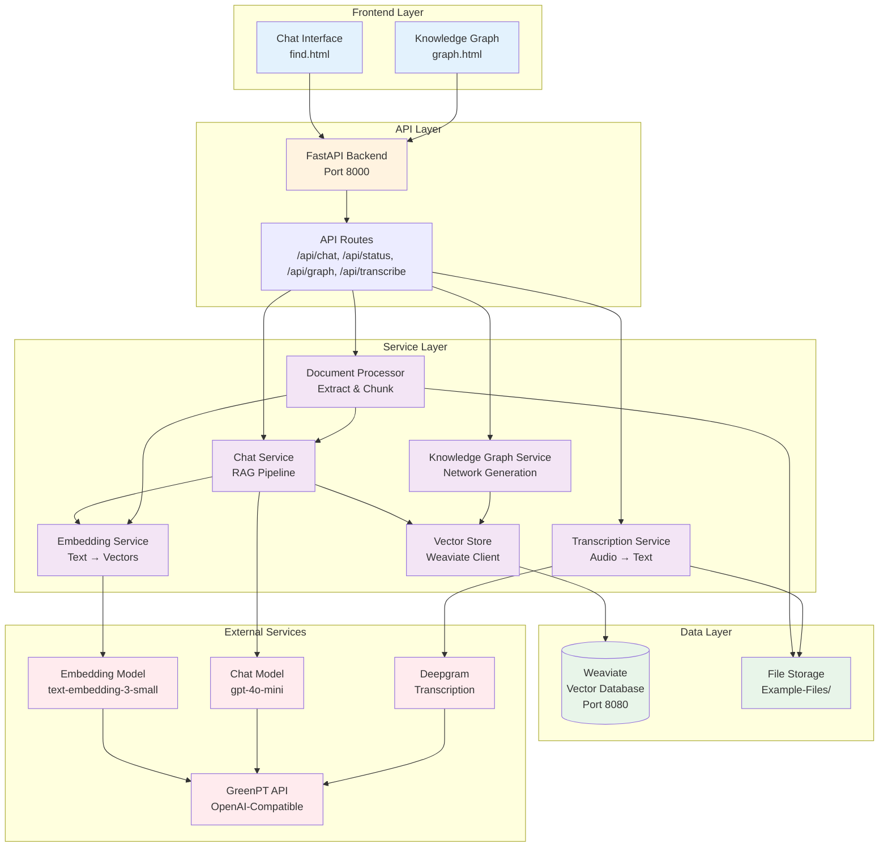
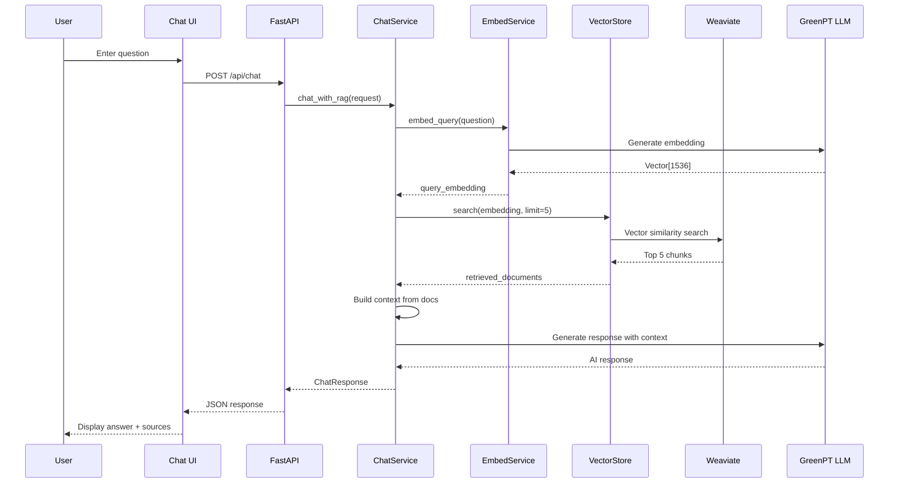
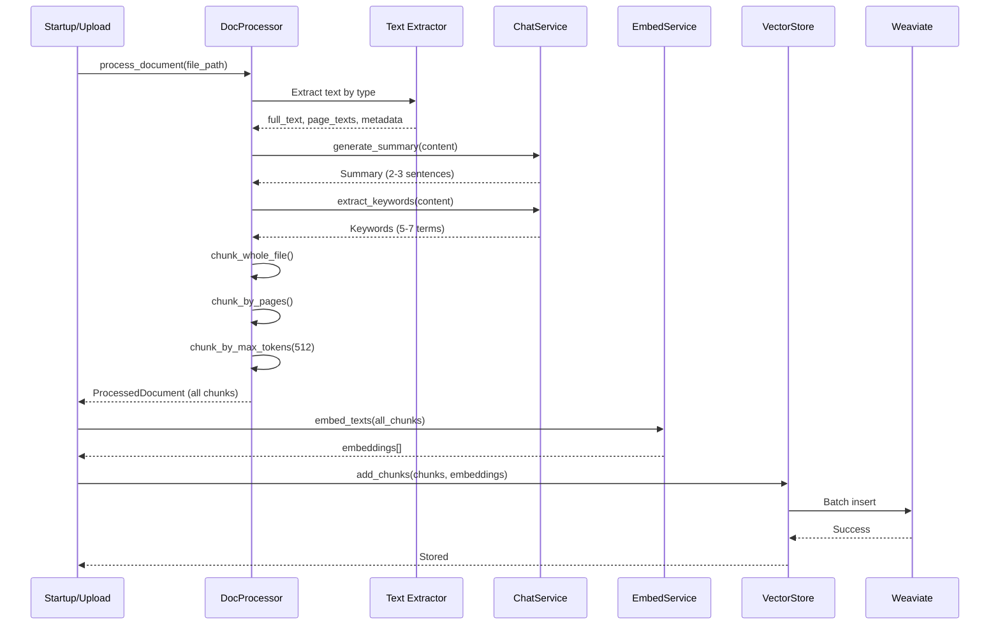
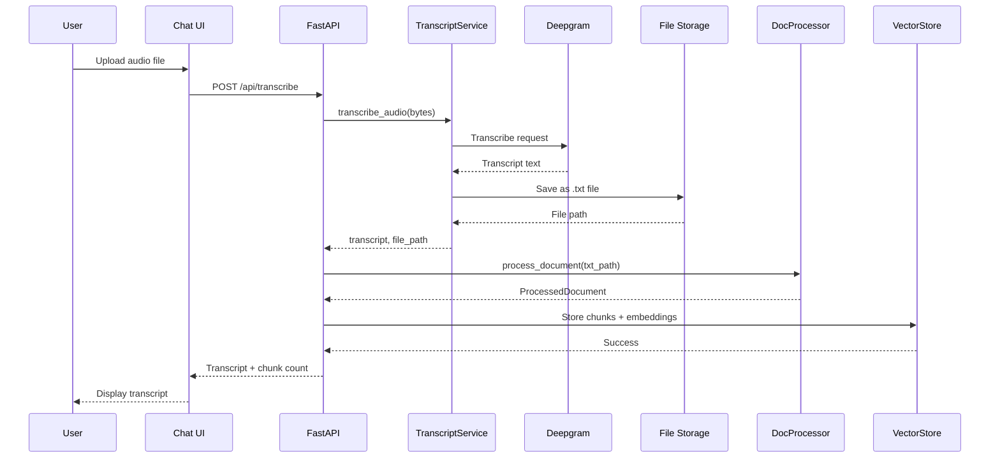
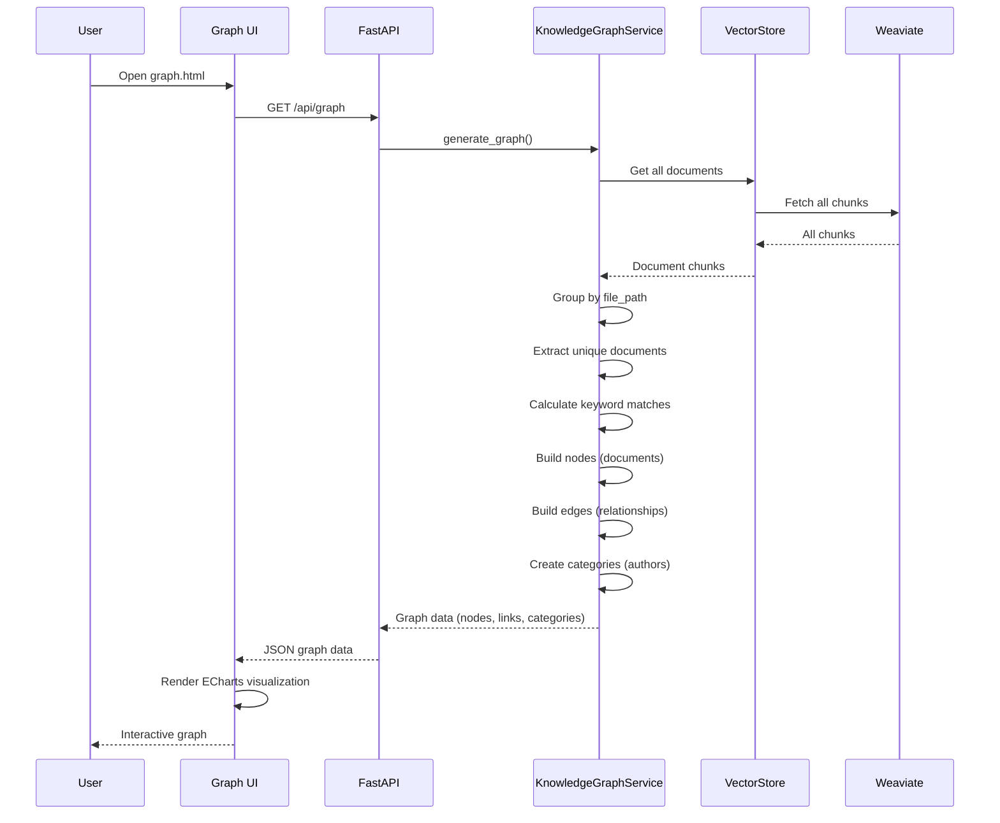
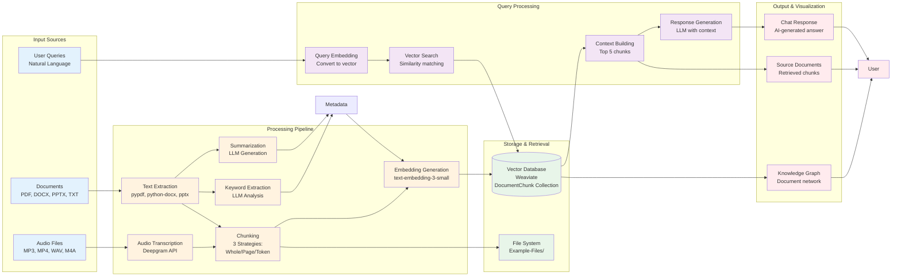
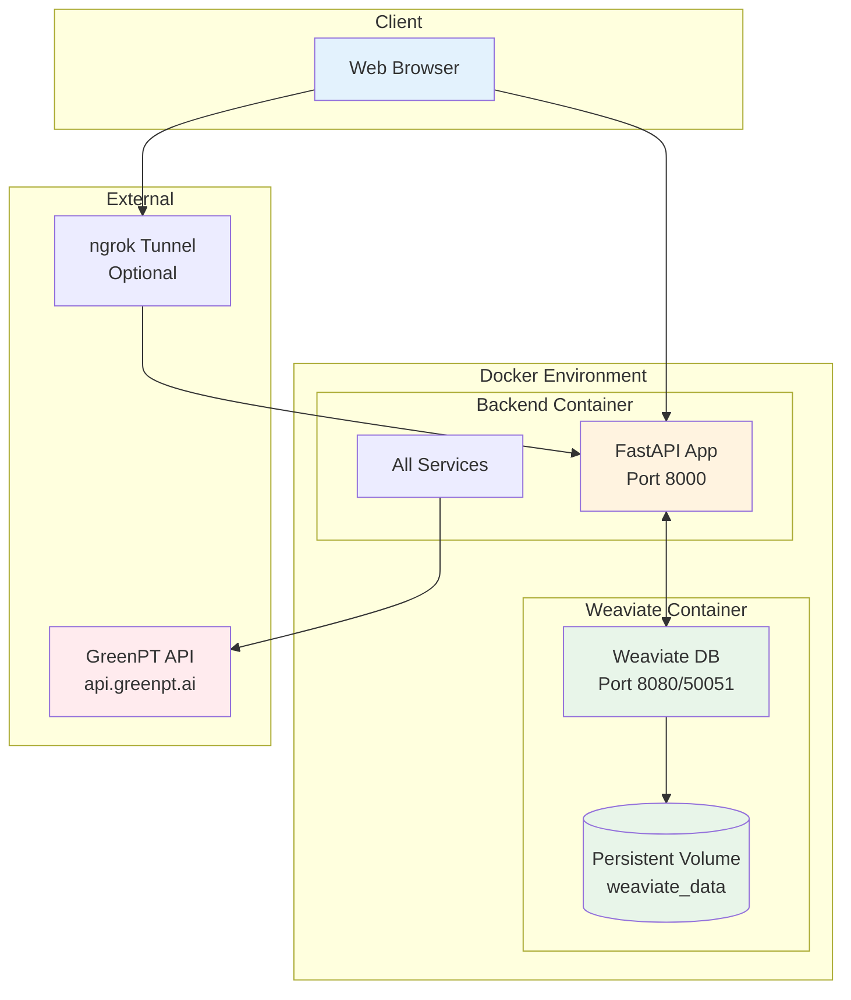

# LUMA RAG Application - Architecture Documentation

## Table of Contents
1. [High-Level Architecture Overview](#high-level-architecture-overview)
2. [Component Interaction Diagram](#component-interaction-diagram)
3. [Data Flow Diagram](#data-flow-diagram)
4. [Technology Stack](#technology-stack)

---

## High-Level Architecture Overview

The LUMA (Shoulders of Giants) RAG application follows a modern microservices architecture with clear separation between frontend, backend, vector database, and external AI services.



### Key Components

#### Frontend Layer
- **Chat Interface (find.html)**: Main user interface for document search and Q&A
- **Knowledge Graph (graph.html)**: Interactive visualization of document relationships

#### API Layer
- **FastAPI Backend**: Async Python web framework handling all HTTP requests
- **API Routes**: RESTful endpoints for chat, status, graph, and transcription

#### Service Layer
- **Chat Service**: Implements RAG pipeline (retrieve + generate)
- **Document Processor**: Extracts and chunks documents with 3 strategies
- **Embedding Service**: Converts text to vector embeddings
- **Vector Store**: Manages Weaviate database operations
- **Knowledge Graph Service**: Generates document network visualization
- **Transcription Service**: Converts audio to text

#### Data Layer
- **Weaviate**: Vector database storing document chunks with embeddings
- **File Storage**: Physical storage for uploaded documents

#### External Services
- **GreenPT API**: OpenAI-compatible API gateway
- **Embedding Model**: text-embedding-3-small for vector generation
- **Chat Model**: gpt-4o-mini for response generation
- **Deepgram**: Audio transcription service

---

## Component Interaction Diagram

This diagram shows the sequence of interactions for the main user flows.

### RAG Query Flow (Chat)



### Document Processing Flow



### Audio Transcription Flow



### Knowledge Graph Generation Flow



---

## Data Flow Diagram

This diagram illustrates how data flows through the system from input to output.



### Data Flow Details

#### Document Ingestion Flow
```
Documents → Text Extraction → Chunking (3 strategies) → Metadata Generation (Summary + Keywords)
→ Embedding Generation → Storage in Weaviate + File System
```

**Chunking Strategies:**
1. **Whole File**: Entire document as single chunk
2. **Page-based**: Each page/slide as separate chunk
3. **Token-based**: 512-token chunks with 25% overlap

**Metadata Generation:**
- Summary: 2-3 sentence overview using LLM
- Keywords: 5-7 key terms extracted by LLM
- Author, created date, file type extracted from document

#### Query Processing Flow
```
User Query → Query Embedding → Vector Similarity Search → Retrieve Top 5 Chunks
→ Build Context → LLM Generation with Context → Response + Sources
```

**RAG Pipeline Steps:**
1. Embed user query into vector space
2. Search Weaviate for similar document chunks
3. Retrieve top 5 most relevant chunks
4. Build context from retrieved chunks
5. Generate response using LLM with context
6. Return answer + source documents

#### Audio Transcription Flow
```
Audio Upload → Deepgram Transcription → Save as TXT → Process as Document
→ Chunk & Embed → Store in Vector Database
```

#### Knowledge Graph Flow
```
All Document Chunks → Group by File → Extract Metadata → Calculate Keyword Matches
→ Build Nodes (Documents) → Build Edges (Relationships) → Render ECharts Graph
```

**Graph Elements:**
- **Nodes**: Documents (sized by connection count)
- **Edges**: Keyword-based relationships (weighted by match count)
- **Categories**: Author groups
- **Opacity**: Time-based (newer docs more visible)

---

## Technology Stack

### Frontend
- **HTML5/CSS3/JavaScript**: Core web technologies
- **marked.js**: Markdown rendering for chat responses
- **Apache ECharts 5.4.3**: Interactive graph visualization
- **jQuery 3.6.0**: AJAX requests

### Backend
- **FastAPI 0.115.0+**: Async Python web framework
- **Python 3.13+**: Core runtime
- **uvicorn**: ASGI server
- **pydantic-settings**: Configuration management

### AI/ML Services
- **GreenPT API**: OpenAI-compatible AI gateway
  - **Embeddings**: text-embedding-3-small (1536 dimensions)
  - **Chat**: gpt-4o-mini
  - **Transcription**: Deepgram (green-s model)
- **tiktoken 0.8.0+**: Token counting (cl100k_base)

### Vector Database
- **Weaviate 1.27.6**: Vector search engine
  - HTTP endpoint: Port 8080
  - gRPC endpoint: Port 50051
  - Collection: DocumentChunk

### Document Processing
- **pypdf 5.1.0+**: PDF text extraction
- **python-docx 1.1.2+**: DOCX processing
- **python-pptx 1.0.2+**: PowerPoint processing

### Infrastructure
- **Docker + Docker Compose**: Containerization
- **ngrok** (optional): Public access tunneling

### Development
- **uv**: Python package installer
- **Custom scripts**: Testing and database management

---

## Deployment Architecture



### Container Configuration

**Backend Service:**
- Base: Python 3.13
- Exposed Port: 8000
- Volumes: ./Example-Files mounted
- Depends on: Weaviate (healthy)

**Weaviate Service:**
- Image: cr.weaviate.io/semitechnologies/weaviate:1.27.6
- Exposed Ports: 8080 (HTTP), 50051 (gRPC)
- Volumes: weaviate_data (persistent)
- Health Check: Every 5 seconds

**Network:**
- Custom bridge network: luma-network
- Internal service communication
- External access via localhost:8000 or ngrok

---

## Key Design Decisions

### 1. Multiple Chunking Strategies
The system implements three different chunking strategies to optimize retrieval:
- **Whole File**: Best for short documents or when full context is needed
- **Page-based**: Preserves page structure, good for presentations and reports
- **Token-based**: Optimal for long documents, ensures consistent chunk sizes

### 2. RAG Pipeline
Uses Retrieval-Augmented Generation to ground AI responses in actual documents:
- Reduces hallucinations
- Provides source attribution
- Enables knowledge base updates without retraining

### 3. Async Architecture
FastAPI's async capabilities enable:
- High concurrency
- Non-blocking I/O operations
- Efficient resource utilization

### 4. Vector Database (Weaviate)
Chosen for:
- Native vector similarity search
- Hybrid search capabilities
- Scalable architecture
- Rich metadata support

### 5. Knowledge Graph
Provides document discovery through:
- Keyword-based relationships
- Author clustering
- Time-based relevance
- Interactive exploration

---

## API Endpoints Reference

| Endpoint | Method | Description |
|----------|--------|-------------|
| `/` | GET | Redirects to main chat interface |
| `/health` | GET | Health check endpoint |
| `/api/status` | GET | System status and document counts |
| `/api/chat` | POST | RAG-powered Q&A endpoint |
| `/api/documents` | GET | List processed documents |
| `/api/graph` | GET | Knowledge graph data |
| `/api/transcribe` | POST | Audio transcription and processing |
| `/webpages/*` | GET | Static file serving (HTML/CSS/JS) |
| `/Example-Files/*` | GET | Document file serving |

---

## Performance Considerations

1. **Embedding Caching**: Embeddings are stored in Weaviate to avoid recomputation
2. **Batch Processing**: Documents are processed asynchronously on startup
3. **Connection Pooling**: Persistent connections to Weaviate and GreenPT API
4. **Lazy Loading**: Services initialized only once on startup
5. **Vector Indexing**: Weaviate maintains HNSW index for fast similarity search

---

## Security Notes

1. **CORS**: Configured to allow all origins (development mode)
2. **API Keys**: GreenPT API key stored in environment variables
3. **File Upload**: Validated file types for transcription
4. **Anonymous Access**: Weaviate configured for anonymous access (development mode)

**Production Recommendations:**
- Restrict CORS origins
- Implement authentication/authorization
- Secure Weaviate with API keys
- Add rate limiting
- Use HTTPS/TLS encryption
- Implement input validation and sanitization
