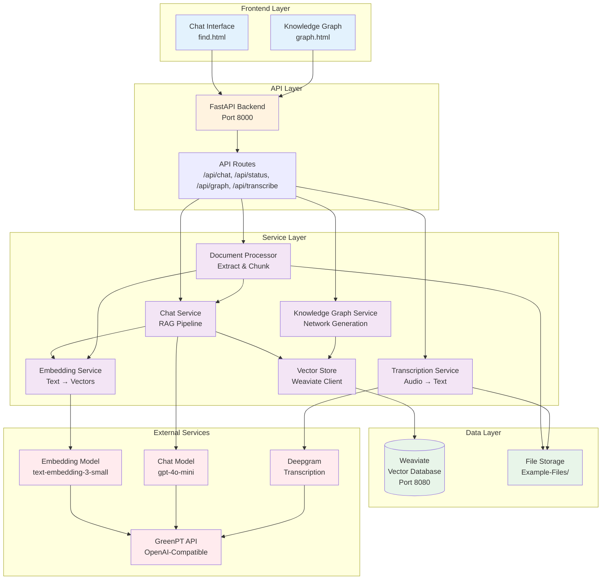
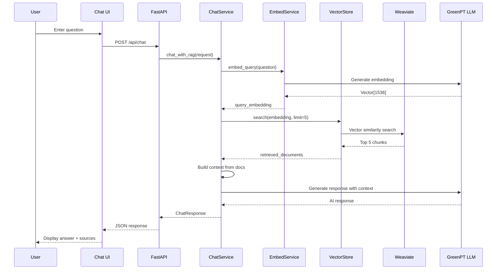
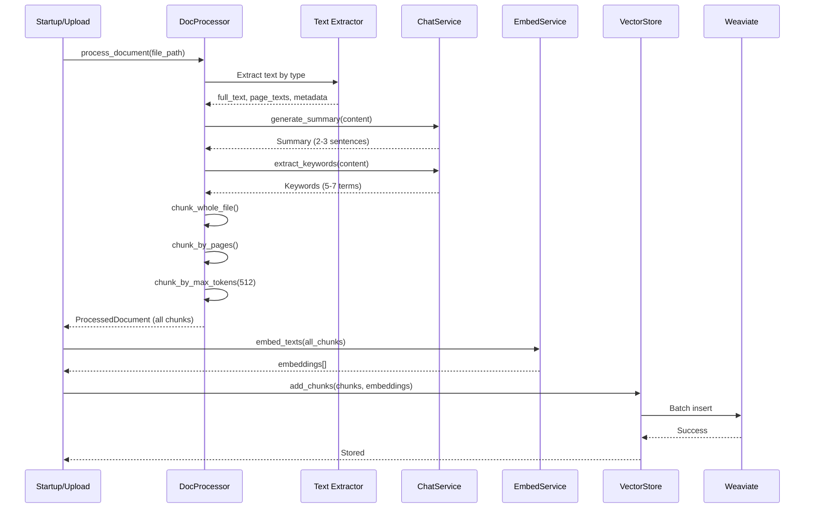
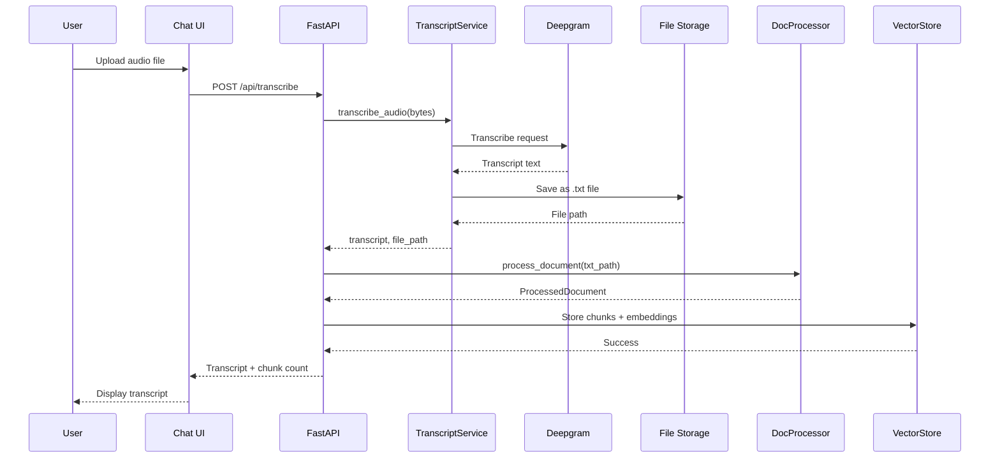
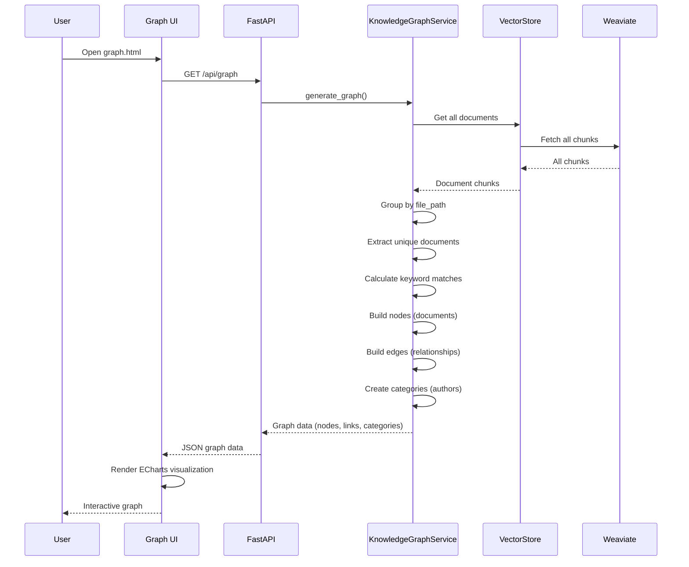
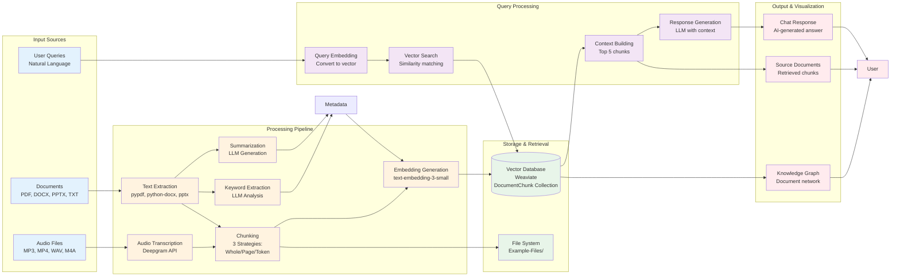
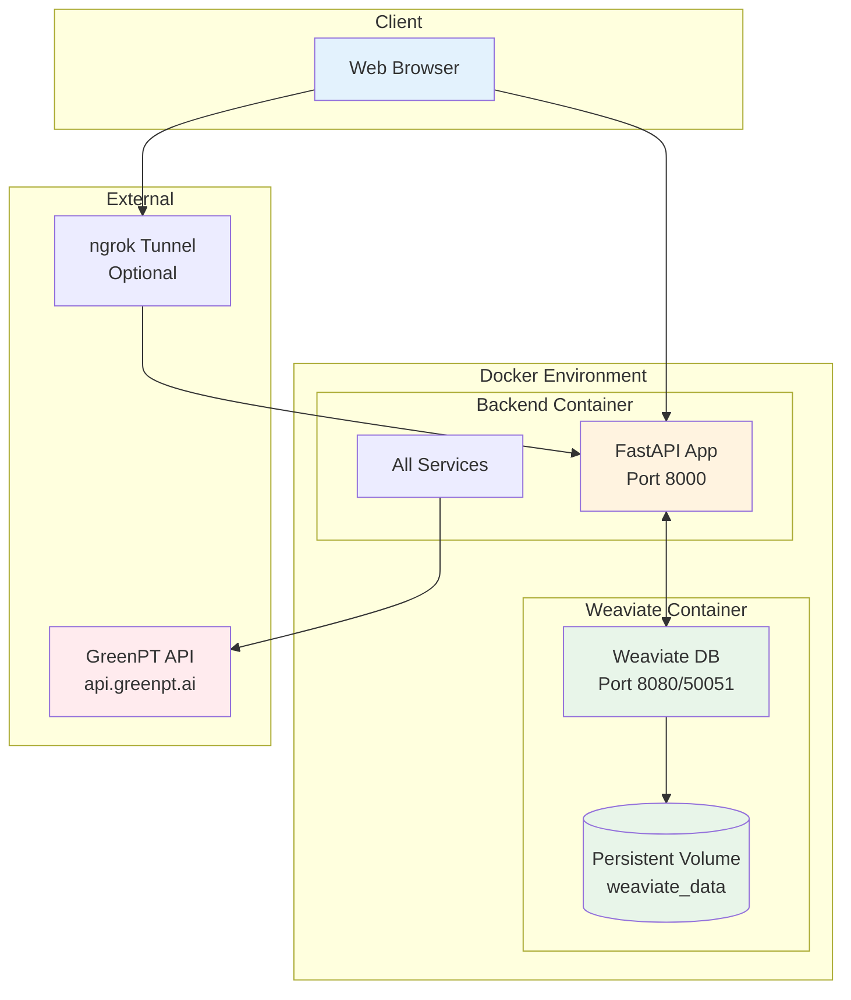

# Luma RAG Application

A production-ready RAG (Retrieval-Augmented Generation) application designed for hospital researchers. This application enables intelligent document search and question-answering using AI-powered semantic search and natural language processing.


## 🚀 Features

### Core Capabilities

- **📄 Multi-Format Document Processing**
  - Supports PDF, DOCX, and PPTX files
  - Automatic metadata extraction (author, creation date, keywords)
  - Three chunking strategies: whole file, page-based, and token-based

- **🔍 Intelligent Search & Retrieval**
  - Vector-based semantic search using Weaviate
  - GreenPT embeddings (OpenAI-compatible)
  - Relevance scoring and ranking
  - Keyword-based document linking

- **💬 AI-Powered Chat Interface**
  - RAG-based question answering
  - Context-aware responses using retrieved documents
  - Conversation history support
  - Markdown rendering for formatted responses


- **📊 Knowledge Graph Visualization**
  - Interactive document network visualization
  - Document relationships based on keyword matching
  - Force-directed graph layout
  - Real-time graph generation
 
    

- **🌐 Web-Based UI**
  - Modern, responsive web interface
  - Real-time status monitoring
  - Document metadata display
  - Knowledge graph integration

## 🛠️ Technology Stack

- **Backend**: FastAPI (Python 3.13+)
- **Vector Database**: Weaviate 1.27.6
- **Embeddings**: GreenPT API (OpenAI-compatible)
- **Frontend**: HTML/CSS/JavaScript with ECharts
- **Document Processing**: PyPDF, python-docx, python-pptx
- **Containerization**: Docker & Docker Compose

## 📋 Prerequisites

- Docker and Docker Compose
- Python 3.13+ (for local development)
- ngrok (optional, for public access)

## 🏃 Quick Start

### 1. Clone the Repository

```bash
git clone https://github.com/k-4-constantine/luma/tree/main
cd LUMA
```

### 2. Configure Environment

Create a `.env.docker` file (copy from `.env.docker.example` if available):

```env
GREENPT_API_KEY=your_api_key_here
GREENPT_BASE_URL=https://api.greenpt.ai/v1
WEAVIATE_URL=http://weaviate:8080
DOCUMENTS_PATH=/app/Example-Files
```

### 3. Start Services

```bash
docker-compose up -d
```

This starts:
- **Weaviate** (vector store) on `http://localhost:8080`
- **Backend** (FastAPI) on `http://localhost:8000`

### 4. Access the Application

- **Main Application**: http://localhost:8000/webpages/find.html
- **Knowledge Graph**: http://localhost:8000/webpages/graph.html
- **API Documentation**: http://localhost:8000/docs
- **Health Check**: http://localhost:8000/health

## 📖 Usage Guide

### Document Processing

Documents in the `Example-Files` directory are automatically processed on startup. The system:

1. Extracts text and metadata from PDF, DOCX, and PPTX files
2. Creates chunks using three strategies:
   - **Whole file**: Entire document as a single chunk
   - **Page-based**: Each page as a separate chunk
   - **Token-based**: Chunks split by token count (max 1000 tokens)
3. Generates embeddings for all chunks
4. Stores everything in Weaviate with metadata

### Using the Chat Interface

1. Open http://localhost:8000/webpages/find.html
2. Enter your question in the search box
3. The system will:
   - Search for relevant documents using semantic similarity
   - Retrieve top 5 most relevant chunks
   - Generate an AI response based on retrieved context
   - Display retrieved documents with metadata

### Knowledge Graph

1. Click "📊 Knowledge Graph" in the header
2. View the interactive network visualization
3. Nodes represent documents, edges represent keyword-based relationships
4. Zoom, pan, and explore document connections

## 🔌 API Endpoints

### Status & Health

- `GET /health` - Health check endpoint
- `GET /api/status` - System status with document counts

### Chat & Search

- `POST /api/chat` - Chat with RAG functionality
  ```json
  {
    "message": "Your question here",
    "conversation_history": []
  }
  ```

### Documents

- `GET /api/documents` - List all processed documents
- `GET /api/graph` - Get knowledge graph data

### Static Files

- `GET /webpages/find.html` - Main application page
- `GET /webpages/graph.html` - Knowledge graph visualization
- `GET /` - Redirects to main application page

## 🌍 Public Access with Ngrok

To expose your local application to the internet, you can use ngrok to create a secure tunnel.

### Installing Ngrok

#### Method 1: Using Chocolatey (Requires Administrator Privileges)
```powershell
# Run PowerShell as Administrator, then execute:
choco install ngrok -y
```

#### Method 2: Manual Installation (Recommended)
1. Visit https://ngrok.com/download/windows
2. Download the ngrok zip package
3. Extract to any directory (e.g., `C:\ngrok`)
4. Add the ngrok.exe directory to your system PATH environment variable

#### Method 3: Using Microsoft Store
1. Open Microsoft Store
2. Search for "ngrok"
3. Click Install

### Configuring Ngrok

#### 1. Get Authtoken
1. Visit https://dashboard.ngrok.com/signup to register an account (free)
2. After logging in, visit https://dashboard.ngrok.com/get-started/your-authtoken
3. Copy your authtoken

#### 2. Configure Authtoken
```powershell
ngrok config add-authtoken YOUR_AUTHTOKEN_HERE
```

### Starting Ngrok Tunnel

#### Start Backend Service Tunnel (Port 8000)
```powershell
ngrok http 8000
```

#### Using Docker Compose with Ngrok

**Option 1: Start ngrok in Background**
```powershell
# Start backend service
docker-compose up -d backend

# Start ngrok in another terminal
ngrok http 8000
```

**Option 2: Using ngrok Configuration File**
Create an `ngrok.yml` configuration file:
```yaml
version: "2"
authtoken: YOUR_AUTHTOKEN_HERE
tunnels:
  backend:
    addr: 8000
    proto: http
```

Then run:
```powershell
ngrok start backend
```

### Accessing Your Application

After starting ngrok, you will see output similar to:
```
Forwarding  https://xxxx-xx-xx-xx-xx.ngrok-free.app -> http://localhost:8000
```

Use this URL to access your local service from anywhere:
- Main Page: `https://xxxx-xx-xx-xx-xx.ngrok-free.app/webpages/find.html`
- API Documentation: `https://xxxx-xx-xx-xx-xx.ngrok-free.app/docs`
- Health Check: `https://xxxx-xx-xx-xx-xx.ngrok-free.app/health`

The application automatically detects ngrok URLs and adjusts API endpoints accordingly.

### Important Notes

1. **Free Tier Limitations**:
   - URL changes each time you restart
   - Connection limit restrictions
   - Requires ngrok account

2. **Security**:
   - Do not use free tier in production
   - Consider setting access password: `ngrok http 8000 --basic-auth="username:password"`

3. **CORS Issues**:
   - If frontend and backend are on different ports, ensure backend CORS configuration allows ngrok domain

### Common Ngrok Commands

```powershell
# Check ngrok status
Invoke-WebRequest http://127.0.0.1:4040/api/tunnels | ConvertFrom-Json

# Check backend service
Invoke-WebRequest http://localhost:8000/health

# View ngrok version
ngrok version

# View tunnel information (ngrok Web Interface)
# Visit: http://127.0.0.1:4040

# Stop ngrok
# Press Ctrl+C in the terminal running ngrok
```

## 📁 Project Structure

```
LUMA/
├── backend/                 # FastAPI backend
│   ├── api/                # API routes
│   ├── models/             # Data models
│   ├── services/           # Business logic
│   │   ├── chat_service.py
│   │   ├── document_processor.py
│   │   ├── embedding_service.py
│   │   ├── knowledge_graph_service.py
│   │   └── vector_store.py
│   └── main.py             # FastAPI app entry point
├── webpages/               # Frontend web pages
│   ├── find.html          # Main chat interface
│   ├── graph.html         # Knowledge graph visualization
│   └── style.css          # Styling
├── Example-Files/          # Documents to process
├── scripts/                # Utility scripts
├── docker-compose.yml      # Docker services configuration
├── Dockerfile.backend      # Backend container definition
└── pyproject.toml          # Python dependencies
```

## 🔧 Configuration

### Environment Variables

- `GREENPT_API_KEY`: Your GreenPT API key
- `GREENPT_BASE_URL`: GreenPT API base URL (default: https://api.greenpt.ai/v1)
- `WEAVIATE_URL`: Weaviate instance URL (default: http://weaviate:8080)
- `DOCUMENTS_PATH`: Path to documents directory (default: /app/Example-Files)

### Docker Compose Services

- **weaviate**: Vector database service
- **backend**: FastAPI application with static file serving

## 🧪 Development

### Local Development Setup

```bash
# Install dependencies
pip install -e .

# Start Weaviate
docker-compose up -d weaviate

# Run backend locally
uvicorn backend.main:app --reload --port 8000
```

### Testing

```bash
# Test document processing
python scripts/test_extraction.py

# Test knowledge graph
python scripts/test_graph.py

# Check vector store
python scripts/show_embeddings.py
```

## 📝 Key Features Explained

### Document Chunking Strategies

1. **Whole File**: Preserves document context, useful for short documents
2. **Page-based**: Maintains page boundaries, good for structured documents
3. **Token-based**: Ensures chunks fit within LLM context windows

### RAG Pipeline

1. **Query Embedding**: Convert user question to vector
2. **Vector Search**: Find similar document chunks in Weaviate
3. **Context Building**: Aggregate top results with metadata
4. **Response Generation**: Use LLM to generate answer from context

### Knowledge Graph

- Nodes represent documents
- Edges represent keyword-based relationships
- Opacity indicates document age (newer = more opaque)
- Categories group documents by author

## 🐛 Troubleshooting

### Backend Not Starting

- Check Docker logs: `docker-compose logs backend`
- Verify Weaviate is healthy: `docker-compose ps`
- Check environment variables in `.env.docker`

### No Documents Found

- Ensure documents are in `Example-Files/` directory
- Check backend logs for processing errors
- Verify document formats are supported (PDF, DOCX, PPTX)

### Graph Not Loading

- Open browser console (F12) to check for errors
- Verify API endpoint is accessible: `curl http://localhost:8000/api/graph`
- Check that documents have been processed

### Ngrok Issues

- Verify ngrok is running: Check http://127.0.0.1:4040
- Ensure authtoken is configured correctly
- Check firewall settings

## 🏗️ Architecture

### High-Level Architecture Overview

The LUMA RAG application follows a modern microservices architecture with clear separation between frontend, backend, vector database, and external AI services.



#### Key Components

**Frontend Layer**
- **Chat Interface (find.html)**: Main user interface for document search and Q&A
- **Knowledge Graph (graph.html)**: Interactive visualization of document relationships

**API Layer**
- **FastAPI Backend**: Async Python web framework handling all HTTP requests
- **API Routes**: RESTful endpoints for chat, status, graph, and transcription

**Service Layer**
- **Chat Service**: Implements RAG pipeline (retrieve + generate)
- **Document Processor**: Extracts and chunks documents with 3 strategies
- **Embedding Service**: Converts text to vector embeddings
- **Vector Store**: Manages Weaviate database operations
- **Knowledge Graph Service**: Generates document network visualization
- **Transcription Service**: Converts audio to text

**Data Layer**
- **Weaviate**: Vector database storing document chunks with embeddings
- **File Storage**: Physical storage for uploaded documents

**External Services**
- **GreenPT API**: OpenAI-compatible API gateway
- **Embedding Model**: text-embedding-3-small for vector generation
- **Chat Model**: gpt-4o-mini for response generation
- **Deepgram**: Audio transcription service

### RAG Query Flow (Chat)



1. User enters question in chat interface
2. Frontend sends POST request to `/api/chat`
3. Chat Service embeds the query using Embedding Service
4. Vector Store searches Weaviate for top 5 similar chunks
5. Chat Service builds context from retrieved documents
6. LLM generates response using the context
7. Response and sources are returned to user

### Document Processing Flow



1. System processes documents from Example-Files directory
2. Document Processor extracts text and metadata (PDF/DOCX/PPTX)
3. Chat Service generates summary and extracts keywords using LLM
4. Content is chunked using three strategies:
   - **Whole file**: Entire document as single chunk
   - **Page-based**: Each page as separate chunk
   - **Token-based**: 512-token chunks with 25% overlap
5. Embedding Service generates vectors for all chunks
6. Vector Store stores chunks and embeddings in Weaviate

### Audio Transcription Flow



1. User uploads audio file via chat interface
2. Transcription Service sends audio to Deepgram
3. Transcript is saved as .txt file
4. Document Processor processes the transcript
5. Chunks and embeddings are stored in Vector Store
6. Transcript is returned to user

### Knowledge Graph Generation Flow



1. Frontend requests graph data from `/api/graph`
2. Knowledge Graph Service retrieves all documents from Vector Store
3. Documents are grouped by file path
4. Keyword matches are calculated between documents
5. Nodes (documents) and edges (relationships) are built
6. Categories (authors) are created
7. Graph data is returned and rendered using ECharts

### Data Flow



**Document Ingestion:**
```
Documents → Text Extraction → Chunking → Metadata Generation
→ Embedding Generation → Storage in Weaviate + File System
```

**Query Processing:**
```
User Query → Query Embedding → Vector Search → Retrieve Top 5
→ Build Context → LLM Generation → Response + Sources
```

**Audio Processing:**
```
Audio Upload → Deepgram Transcription → Save as TXT
→ Process as Document → Store in Vector Database
```

### Deployment Architecture



The application runs in Docker containers:

**Backend Container:**
- Base: Python 3.13
- Exposed Port: 8000
- Volumes: ./Example-Files mounted
- Depends on: Weaviate (healthy)

**Weaviate Container:**
- Image: cr.weaviate.io/semitechnologies/weaviate:1.27.6
- Exposed Ports: 8080 (HTTP), 50051 (gRPC)
- Volumes: weaviate_data (persistent)
- Health Check: Every 5 seconds

**Network:**
- Custom bridge network: luma-network
- Internal service communication
- External access via localhost:8000 or ngrok

### Key Design Decisions

1. **Multiple Chunking Strategies**: Three strategies optimize retrieval for different document types
   - Whole File: Best for short documents or when full context is needed
   - Page-based: Preserves page structure for presentations and reports
   - Token-based: Optimal for long documents with consistent chunk sizes

2. **RAG Pipeline**: Uses Retrieval-Augmented Generation to ground AI responses
   - Reduces hallucinations
   - Provides source attribution
   - Enables knowledge base updates without retraining

3. **Async Architecture**: FastAPI's async capabilities enable high concurrency and efficient resource utilization

4. **Vector Database (Weaviate)**: Chosen for native vector similarity search, scalability, and rich metadata support

5. **Knowledge Graph**: Provides document discovery through keyword relationships, author clustering, and time-based relevance

### Performance Considerations

1. **Embedding Caching**: Embeddings stored in Weaviate to avoid recomputation
2. **Batch Processing**: Documents processed asynchronously on startup
3. **Connection Pooling**: Persistent connections to Weaviate and GreenPT API
4. **Lazy Loading**: Services initialized only once on startup
5. **Vector Indexing**: Weaviate maintains HNSW index for fast similarity search

### Security Notes

**Current Configuration (Development Mode):**
- CORS: Configured to allow all origins
- API Keys: GreenPT API key stored in environment variables
- File Upload: Validated file types for transcription
- Anonymous Access: Weaviate configured for anonymous access

**Production Recommendations:**
- Restrict CORS origins
- Implement authentication/authorization
- Secure Weaviate with API keys
- Add rate limiting
- Use HTTPS/TLS encryption
- Implement input validation and sanitization

## 🤝 Contributing

1. Fork the repository
2. Create a feature branch
3. Make your changes
4. Submit a pull request

## 📄 License

See `LICENSE` file for details.

## 🙏 Acknowledgments

- Weaviate for vector database capabilities
- GreenPT for embeddings API
- FastAPI for the excellent web framework
- ECharts for graph visualization
